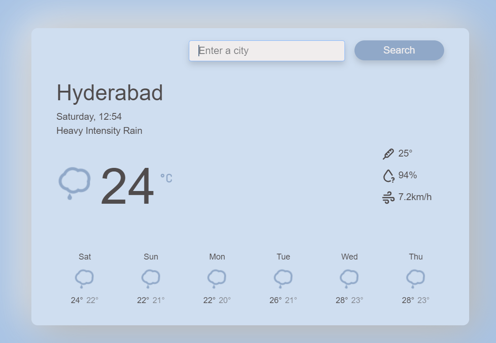

## Weather Information Service

## Introduction:

Welcome to the Weather App documentation. This application provides users with real-time weather information based on their location. It utilizes React.js for the frontend development and integrates with a weather API to fetch weather data.

This is a simple weather information service built with React that fetches weather data based on user input (city name) using the API



## Setup and Installation:

To run the Weather App locally, follow these steps:

1. Clone the repository : git clone https://github.com/ashokegorlu/weather-info-service.git

2. Navigate to the project directory
   cd Whether

3. Install dependencies: npm install

4. Start the development server:
   npm start

5. Open your browser and go to `http://localhost:3000` to view the app.

## File Structure:

WEATHER-APP/
│
├── node_modules/
├── public/
│ ├── index.html
│ └── logo.svg
│
└── src/
├── components/
│ ├── FormattedDate.jsx
│ ├── SearchForm.jsx
│ ├── Temperature.jsx
│ ├── WeatherForecast.jsx
│ ├── WeatherForecastDay.jsx
│ └── WeatherIcon.jsx
│
├── utils/
├── App.js
├── App.test.js
├── index.js
└── index.css

```

## Components:
### SearchForm:
Responsible for allowing users to search for weather information by location.

### WeatherForecast:
Displays the weather forecast for a specified location.

### WeatherForecastDay:
Represents a single day's weather forecast within the WeatherForecast component.

### WeatherIcon:
Displays weather icons corresponding to different weather conditions.

### Temperature:
Displays temperature information in the specified format.

### FormattedDate:
Formats and displays dates in a user-friendly format.

## API Integration:
The Weather App integrates with a weather API to fetch weather data based on the user's location input.

## Data Flow:
1. User interacts with the app, entering a location in the search form.
2. The app sends a request to the weather API with the provided location.
3. Upon receiving the response, the data is processed and displayed in the relevant components.

```

## Deployment:

This app can be deployed to various hosting platforms such as Heroku, Netlify. Follow the platform-specific deployment instructions for deployment.

## Usage:

1. Enter a location in the search form.
2. View the weather forecast displayed on the page.

Feel free to customize and expand upon this documentation to suit the specific features and requirements of your Weather App.
